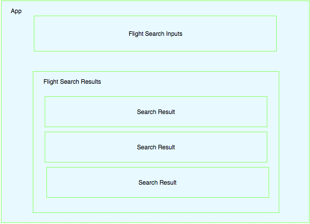

# react-flight-search

A workshop for building a simple React app that searches for flights on Expedia.

- [Create a new React application](#create-a-new-react-application)
- [Install dependencies](#install-dependencies)
- [Write the React components](#write-the-react-components)
- [Call the flight search API](#call-the-flight-search-api)

## Getting Started

The repository has 2 branches:

*   __master__: This branch contains this README, as well as a partial, fill-in-the-blanks solution.
*   __[solution](https://github.com/eg-ui-conf-2018/react-flight-search/tree/solution)__: The complete solution to the exercise.

If you choose to start with the __master__ branch, clone the branch, run `npm install && npm start`, and skip to [Write the React Components](#write-the-react-components) to get started.

## Create a new React application

_NOTE: This section is not necessary if you are starting with the __master__ (or solution) branch._

It normally takes a lot of time to properly set up and configure a development environment for a React application. Luckily, there are many existing ones to choose from. For this workshop, we will use the [create-react-app](https://github.com/facebook/create-react-app#creating-an-app) template.

First, create the template application:

```bash
$ npx create-react-app my-app
```

Now navigate into the application that you just created and start the application:

```bash
$ cd my-app
$ npm start
```

Your default browser will automatically open to `localhost:3000` which is where the application is configured to run. You can now make changes to the code in `src` directory. As soon as you save the changes, the app in the browser should automatically update thanks to Hot Module Replacement which was set up by create-react-app.

## Install dependencies

_NOTE: This section is not necessary if you are starting with the __master__ (or solution) branch._

Code re-use is always encouraged in software development. Many libraries and packages have been published to central servers for other engineers to use. Similar to Maven (`mvn`) in the Java world, JavaScript uses NPM (`npm`) as the package management registry. To save us time, we will install the following libraries and React components.

### [momentjs](https://momentjs.com/)
A library that will help us to manipulate and display dates and times.
```bash
$ npm install moment --save
```

### [react-datepicker](https://reactdatepicker.com/) (Optional)
A date picker component that we can leverage for users to select departure and arrival dates.

The simpler alternative is to use a plain text input. The date format expected by the Flight Search API is `YYYY-MM-DD`.

```bash
$ npm install react-datepicker --save
```
If you plan to use the `<DatePicker>` component, add the following import statement in the JavaScript file that will use it:
```javascript
import 'react-datepicker/dist/react-datepicker.css';
```

### [query-string](https://www.npmjs.com/package/query-string) (Optional)
A library to help parse and stringify URL query strings. You may find it useful when making requests to the Expedia flight search API.
```bash
$ npm install query-string --save
```

### [react-spinners](https://www.npmjs.com/package/react-spinners) (Optional)
A component that we can use to create loaders while fetching data for a better user experience.
```bash
$ npm install react-spinners --save
```

### [react-bootstrap](https://www.npmjs.com/package/react-bootstrap) (Optional)
A React implementation of [Bootstrap](http://getbootstrap.com/). It will provide you with layouts and components which you may find useful when building your application.

This library relies on the Boostrap stylesheets. If you plan to use it, add a CDN-hosted version of the Bootstrap stylesheet to your `public/index.html` file's `<head>` section:

```html
<link rel="stylesheet" href="https://maxcdn.bootstrapcdn.com/bootstrap/3.3.7/css/bootstrap.min.css" integrity="sha384-BVYiiSIFeK1dGmJRAkycuHAHRg32OmUcww7on3RYdg4Va+PmSTsz/K68vbdEjh4u" crossorigin="anonymous">
```

Then, install the library:

```bash
$ npm install react-bootstrap --save
```

## Write the React components

_NOTE: If you started with the __master__ branch, be sure to first run `npm install && npm start` before getting started here._

There is no right or wrong way to build the application. The purpose of the exercise is to help people get a bird's eye view of a React application. However, there are a few best practices that might help.

### Break the app into smaller components
In general, it's best to break a large component into smaller, reusable components. Your code will be more readable and maintainable.

Again, there is no right or wrong way for doing this. Here is just one example of how you could componentize your application:



### Step by step instructions
If you have some experience with React already, please feel free to build your application in your own way, and share with us later. However, if you have no idea where to start, this section will give you some pointers.

- [Create the App component](#create-the-app-component)
- [Build flight search input](#build-flight-search-input)
- [Add logic to capture search values](#add-logic-to-capture-search-values)
- [Create flight fetching function for App component](#create-flight-fetching-function-for-App-component)
- [Invoke flight fetching in flight search input component](#invoke-flight-fetching-in-flight-search-input-component)
- [Build flight offers component](#build-flight-offers-component)
- [Polish user experience](#polish-user-experience)

#### Create the App component
To build the application, we first need a component that brings all the different pieces (flight search inputs and search results) together. The create-react-app generator has already given us a good start. All you need to do is remove unnecessary code, and make a few modifications to `App.js`. To simplify things, we just need two main sections: Title and Content. We will render the flight search input and the search results in the Content section. For example, the `App.js` will look something like:

```html
 <div className="App">
   <header className="App-header">
     <h1 className="App-title">Flight Search Workshop</h1>
   </header>
   <div className="App-content">
     <FlightSearch .../>
     <SearchResults .../>
   </div>
 </div>
```

#### Build flight search input
The flight search input will include:
- 2 text inputs for origin and destination
- 2 date pickers (or plain text inputs) for departure and return dates
- 1 button to run the search

In this first iteration, let's keep things simple by not being over-concerned about the styles and form validations. First of all, we need to create a React component to capture the user inputs. Let's start out by creating a file called `FlightSearch.js`. You may follow the same syntax to `App.js` to create an empty component.

The `render` function decides what gets rendered in the browser. We will define the flight search-related elements there. For the origin/destination inputs and the search button, you may use core HTML elements, or leverage any component from [react-bootstrap](https://www.npmjs.com/package/react-bootstrap). For the date picker, we recommend using the `DatePicker` component from [react-datepicker](https://reactdatepicker.com/).

#### Add logic to capture user inputs
With all of the input elements built, we now need to capture user-entered values so we can supply the values to the flight search API.

One way to do that is capture the origin, destination, departure and return dates in our component's [state](https://reactjs.org/docs/faq-state.html). To do so, we will first create a constructor, and define the states and their initial values.

```javascript
constructor() {
   super();
   this.state = {
      origin: '',
      destination: '',
      departureDate: null, // string: 'YYYY-MM-DD'
      returnDate: null // string: 'YYYY-MM-DD'
   };
}
```

You can supply the state values for origin and destination to the input fields. For example:

```html
<input type="text" placeholder="Origin" value={this.state.origin}/>
```

To capture the changes to the input component, let's create the `onOriginChange` function, and bind the function for the callbacks.

```javascript
constructor() {
    ...
    this.onOriginChange = this.onOriginChange.bind(this);
}

...

onOriginChange(evt) {
   this.setState({
       origin: evt.target.value
   });
}
```

Then bind the `onOriginChange` function to the input's onChange event:

```html
<input type="text" placeholder="Origin" value={this.state.origin} onChange={this.onOriginChange}/>
```

#### Create flight fetching function for App component
Assuming your `FlightSearch` component is able to gather all of the search input data, we now need to tell it how to [call the flight search API](#call-the-flight-search-api). Because the search results will be displayed in the search results component, it is better if we keep the flight search API function in the `App` component, so that the `App` can supply the API response to the search results component. Here is the function definition example:

```javascript
async searchFlights(origin, destination, departureDate, returnDate) {
    const searchCriteria = {
        departureAirport: origin,
        arrivalAirport: destination,
        departureDate: departureDate, // string: 'YYYY-MM-DD'
        returnDate: returnDate,  // string: 'YYYY-MM-DD'
        maxOfferCount: 10, // limit the offer count so that it won't take too long to get the response
        key: '<api-key>' // remember NOT to commit this key if you commit any code
    };
    
    // we are using stringify from query-string package, but feel free to build the queries manually
    const response = await fetch(`https://apim.expedia.com/x/mflights/search?${stringify(searchCriteria)}`);
    const results = await response.json();

    // set the results in the state, so that the components would update
    this.setState({results});
}
```

#### Invoke flight fetching in flight search input component
With the `searchFlights` function defined, we can now pass the function to the `FlightSearch` component as props in your `App.js`:

```html
<FlightSearch searchFlights={this.searchFlights} />
```

The `flightSearch` function is now accessible in the `FlightSearch` component as `this.props.searchFlights`. Therefore, the `FlightSearch` component will just need to call `searchFlights` when the search button is clicked.

#### Build flight offers component
Similar to how the `FlightSearch` component was built, you will create another component to display the results. The `App` component will pass the flight search API response data as props to the `SearchResults` component to display. For this exercise, you can decide what data is important to show to the user (e.g. carrier, departure and arrival date/time, price, etc).

#### Polish user experience
It is very impressive if you are able to get to this point in such a short time! However, your application may be a little rough in user experience (UX). Here are a few "nice to haves" to improve the user experience:

- Consistent styles
- Input validations
- Loading experience (e.g. show a spinner while searching flights to indicate asynchronous activity)
- Edge case handling (e.g. empty search results, unsupported airports)
- Anything else that you can think of!

## Call the flight search API

In this exercise, we will call the [Expedia flight search service](https://hackathon.expedia.com/docs/public/api/Flight%20Search/) to get real flight search data.

To see sample data, open the [sample-response.json](sample-response.json) file.

An API key sent as a `key` header is required and will be shared during the exercise.

Airport codes must be specified in the `departureAirport` and `arrivalAirport` query parameters. Airport code query parameters must be standard airport abbreviations in uppercase. Only the following airports are supported (most US and Canadian airports):

> `ABR, ABI, CAK, ALS, ABY, ALB, ABQ, AEX, ABE, AIA, APN, AOO, AMA, ANC, ATW, AVL, ASE, AHN, ATL, ACY, AGS, AUG, AUS, BFL, BWI, BGR, BHB, BRW, BTR, BPT, BKW, BED, BLI, BJI, BET, BTT, BIL, BGM, BHM, BIS, BMI, BMG, BLF, BOI, BOS, BZN, BKX, BRO, BQK, BUF, BUR, BRL, BBF, BTV, BTM, CGI, CLD, CNM, CPR, CID, CMI, CHS, CRW, CLT, CHO, CHA, CYS, CHI, MDW, CHI, ORD, CIC, CVG, CKB, CLE, CVN, COD, CLL, COS, COU, CAE, CSG, CLU, GTR, OLU, CMH, CDV, CRP, DAL, DFW, DAY, DAB, DEC, DEN, DSM, DTW, DTT, DVL, DIK, DLG, DDC, DHN, DUJ, DBQ, DLH, DRO, DUT, EAU, EEK, IPL, ELD, ELP, EKO, ELM, WDG, ERI, ESC, EUG, ACV, EVV, FAI, FAR, FMN, XNA, FAY, FLG, FNT, FLO, FOD, FLL, TBN, RSW, FSM, VPS, FWA, FYU, FAT, GNV, GCK, GCC, GDV, GFK, GRI, GJT, GRR, GBD, GTF, GRB, LWB, GSO, GLH, PGV, GSP, GPT, GUC, HGR, HNM, CMX, HRL, MDT, HRO, BDL, HVR, HYS, HLN, HIB, BIG, HHH, HOB, HOM, HNL, MKK, EFD, HOU, IAH, EFD, HTS, HSV, HON, HYA, IDA, IND, INL, IYK, IMT, IWD, ISP, ITH, JAC, JAN, MKL, JAX, OAJ, JMS, JHW, JST, JPR, JLN, JNU, OGG, BFF, AZO, LUP, FCA, MCI, JHM, EAR, ENA, KTM, EYW, GRK, AKN, IGM, IRK, LMT, TYS, ADQ, LSE, LFT, LCH, HLL, LNY, LNS, LAN, LAR, LRD, LRU, LAS, LBE, PIB, LAW, LAB, LWS, LEW, LWT, LEX, LBL, LIH, LNK, LIT, LGB, GGG, QLA, SDF, LBB, LYH, MCN, MSN, MHT, MHK, MBL, MWA, MQT, MVY, MCW, MSS, MFE, MCK, MFR, MLB, MEM, MEI, MIA, MAF, MLS, MKE, MSP, MOT, MSO, MOB, MOD, MLI, MLU, MRY, MGM, MTJ, MGW, MWH, MSL, MKG, MRY, ACK, ABF, BNA, EWN, HVN, MSY, LGA, JFK, NYC, EWR, SWF, PHF, OME, ORF, OTH, LBF, OAK, OGS, OKC, OMA, ONT, SNA, MCO, OSH, OWB, OXR, PAH, PGA, PSP, PFN, PKB, PSC, PLN, PDT, PNS, PIA, PHL, PHX, PIR, SOP, PIT, PIH, SEA, PNC, PWM, PDX, PSM, PRC, PQI, PVD, PVC, PUB, PUW, UIN, RDU, RAP, RDD, RDM, RNO, RHI, RIC, RIW, ROA, RST, ROC, RKS, RFD, SHD, RKD, ROW, RUT, SMF, MBS, SLN, SPY, SLC, SJT, SAT, SAN, QSF, SFO, SJC, SBP, SDP, SBA, SAF, SMX, STS, SLK, SRQ, CIU, SAV, SHR, SDY, SVC, SUX, FSD, SIT, SGY, SBN, GEG, SPI, CEF, SGF, VSF, STC, SGU, STL, PIE, SCE, SBS, SUN, SRY, TLH, TPA, TAX, TXK, TVF, OOK, TOL, TOP, TVC, TTN, TUS, TUL, TUP, TWF, TYR, UNK, EGE, VDZ, VLD, VCT, VIS, ACT, ALW, DCA, WAS, IAD, ALO, ART, ATY, CWA, EAT, PBI, WYS, HPN, SPS, ICT, AVP, IPT, ISN, ILG, ILM, OLF, WRL, WRG, YKM, YAK, YUM, YXX, YAA, YEK, YBG, YYC, YBL, YGR, YCG, YYG, YMT, YYQ, YXC, YDF, YHD, YEG, YEO, YMM, YYE, YXJ, YSM, YFC, YQX, YGP, YQU, YHZ, YHM, YFB, YKA, YLW, YQK, YGK, YQL, YXU, YXH, YQM, YYY, YMQ, YUL, YCD, YYB, YOW, YYF, YZT, YPW, YPR, YQB, YQZ, YRT, YRL, YQR, YRJ, YUY, YSJ, YZP, YZR, YXE, YAM, YZV, YXL, YYD, YYT, YSB, YQY, YXT, YTH, YQT, YTS, YYZ, YTO, YTZ, YVO, YVR, YYJ, YWK, YXY, YWL, YQG, YWG, YZF, LAX, SHV`

To simplify the workshop, you might start by assuming that the origin and destination fields will always be supplied with valid airport codes. However, if time allows, your application could require and validate these inputs.

Lastly, dates in the format `YYYY-MM-DD` must be sent as `departureDate` and `returnDate` query parameters.

## Credits

[@yanmaoyuan](https://github.com/yanmaoyuan), [@treyp](https://github.com/treyp), [@stefcameron](https://github.com/stefcameron)
